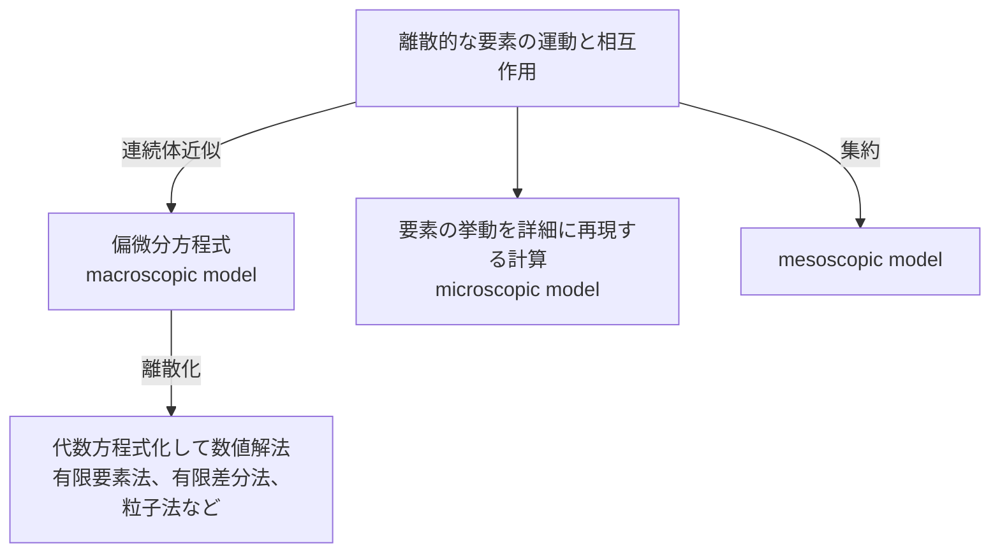

- 分類
	- [[マクロスコピックモデル]] (macroscopic model; 巨視的モデル)
		- ひとつの場の方程式
		- [[連続体近似]]
		- *e.g.*
			- Navier-Stokes eq.
	- [[ミクロスコピックモデル]] (microscopic model; 微視的モデル)
		- 実際の粒子同士の詳細な相互作用
		- *e.g.*
			- 人間を模した[[セルオートマトン]]や[[マルチエージェントシステム]]
			- [[第一原理計算]]
	- [[メゾスコピックモデル]] (mesoscopic model; 中間視的モデル)
		- *e.g.*
			- 人間の集団的な行動の近似
		- 多数の[[要素]]（ミクロとマクロの中間）による離散モデル
		- 要素の挙動と要素間の[[相互作用]]で**マクロ特性**が再現されるように規定する
			- 保存則 / 反応則 / [[ランダム]]運動
		- より階層性が強い
		- 単に性質を集約するだけではない[[創発]]的現象の可能性
